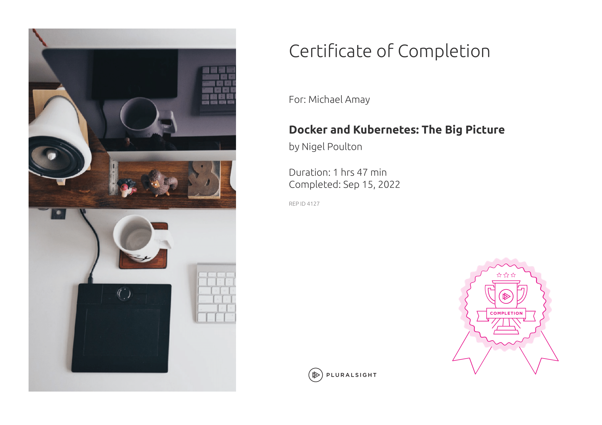
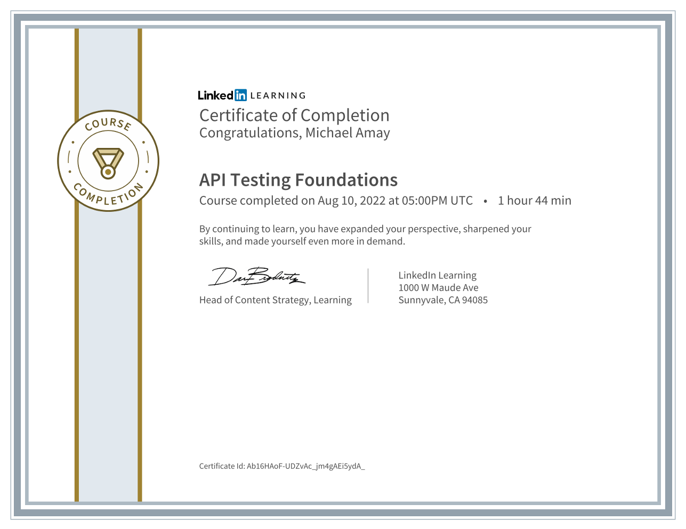
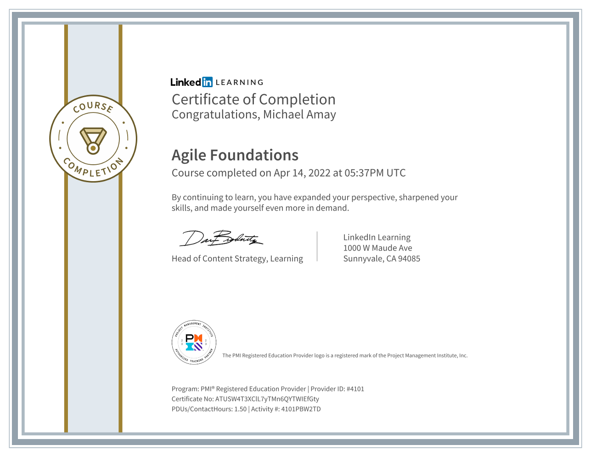
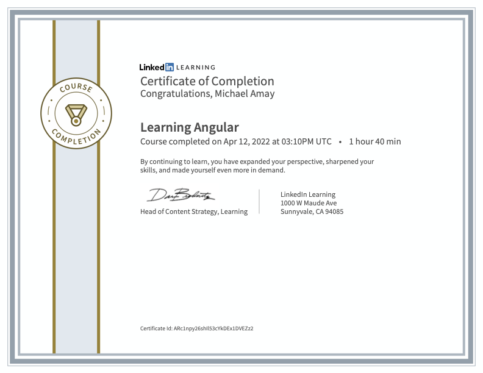

# Certification Wall

<html>
    <head>
        
</head>
<body>
<!--box 3 is odd frame.-->
<!--
        

            

                
            

        

-->    
        

            

                

            

            

                

            

        

    
        

            

                

            

            

                

            

        

        

            

                
            

            

                
            

        

        

            

                
            

            

                
            

        

        

            

                
            

            

                
            

        

        

            

                
            

            

                
            

        

    </body>

</html>

 
 
 
 
 
 
 
 
 
 
 
 
 
 
 
 
 
 
 
 
 
 

 
 
 
 
 
 
 
 
 
 
 
 
 
 
 
 
 
 
 
 
 
 
 
 
 
 

 
 
 
 
 
 
 
 
 
 
 
 
 
 
 
   
 
   
 
   
 
   
 
   
 
   
 
 
 
 
 
     
 
 
 
     
 
 
 
     
 
 
 
 
 
 
  
  
  
                  
